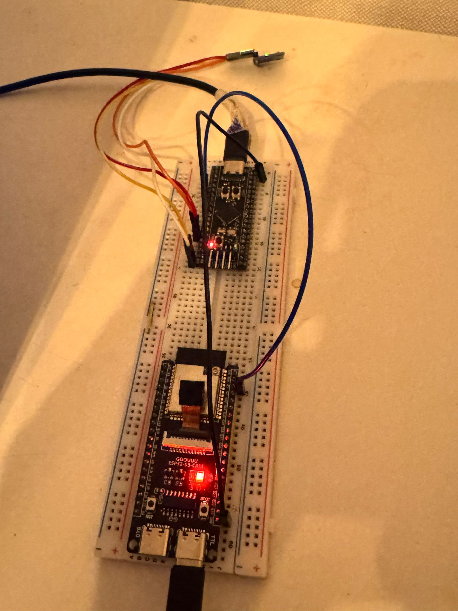
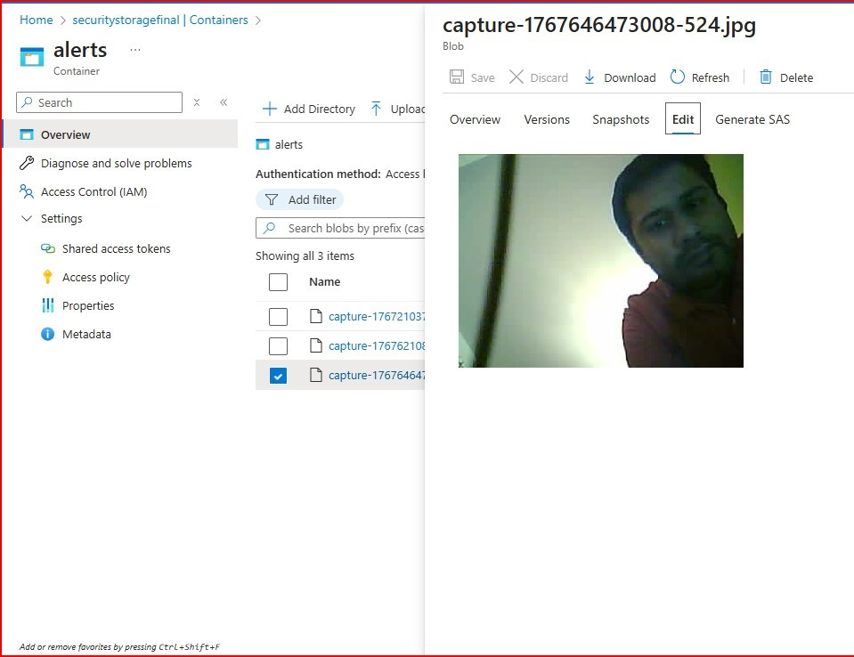
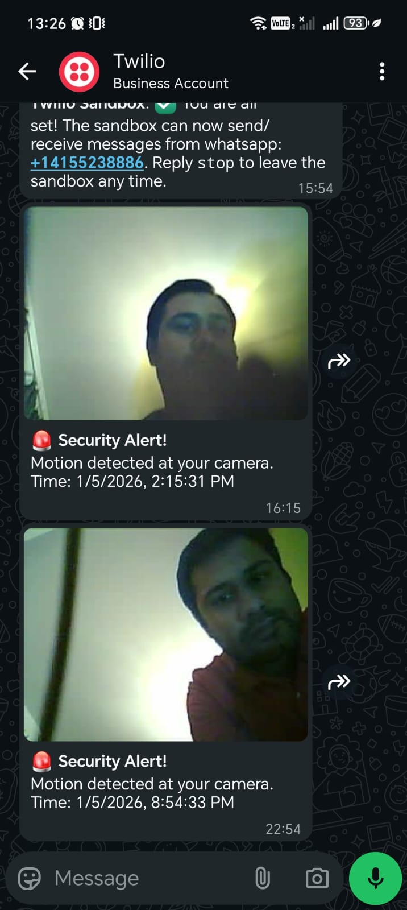

# Event-Driven IoT Surveillance Framework

A secure, multi-MCU IoT security system that integrates edge motion detection with Azure cloud serverless functions for real-time surveillance.

---

## 🎥 Project Gallery
*Visualize the end-to-end flow from hardware trigger to cloud notification.*

| **1. Hardware Setup (Breadboard)** | **2. Azure Storage Cloud** | **3. WhatsApp Alert Output** |
| :---: | :---: | :---: |
|  |  |  |
| *STM32 & ESP32-S3 Hardware Integration.* | *Image captures stored in Azure Blob Storage.* | *Real-time alert with SAS-secured link.* |

---

## 🚀 System Architecture
This framework uses a master-slave configuration to optimize power efficiency and real-time response:

1.  **Edge Detection (STM32 Blackpill):** Constantly monitors an **MPU6050** accelerometer via **I2C**. Upon detecting movement beyond the threshold, it sends a `TILT_ALERT` signal over **UART**.
2.  **Image Capture (ESP32-S3):** Acts as the Cloud Gateway. It receives the UART trigger, captures a JPEG image, and publishes it to **Azure IoT Hub** via **MQTT**.
3.  **Cloud Logic (Azure Functions):** A Node.js serverless function triggers on incoming IoT Hub events. It stores the binary data in **Azure Blob Storage**.
4.  **Instant Notification (Twilio):** The system generates a **SAS-tokenized** image link and sends a WhatsApp notification via the **Twilio API**.

---

## 🛠️ Tech Stack
* **Microcontrollers:** STM32F401 (Blackpill), ESP32-S3.
* **Protocols:** I2C (Sensor data), UART (Inter-MCU communication), MQTT (Cloud telemetry).
* **Cloud Services:** Azure IoT Hub, Azure Functions (Node.js runtime), Azure Blob Storage.
* **External APIs:** Twilio WhatsApp Business API.

---

## 📂 Repository Structure
The project is organized into three specialized modules:

* **`stm32_pio/`**: Firmware for motion detection and UART signaling.
* **`esp32s3_idf/`**: ESP-IDF implementation for camera handling and MQTT communication.
* **`Azure_Functions_New/`**: Serverless Node.js logic for cloud processing and notifications.

---

## 🔒 Security & Optimization
* **Data Privacy:** Uses Shared Access Signature (SAS) tokens to ensure image links are temporary and secure.
* **Power Management:** High-power modules (Camera/WiFi) only activate when signaled by the low-power motion monitor.
* **Environment Management:** All sensitive keys are managed via `local.settings.json` (ignored in Git) and Azure Environment Variables.

---

## 🛠️ Setup Instructions
1. Clone the repository.
2. For **Azure Functions**, create a `local.settings.json` based on the provided `local.settings.example.json`.
3. Flash the STM32 and ESP32 firmware using PlatformIO and ESP-IDF respectively.
4. Update Wi-Fi and Azure credentials in the respective firmware files.
